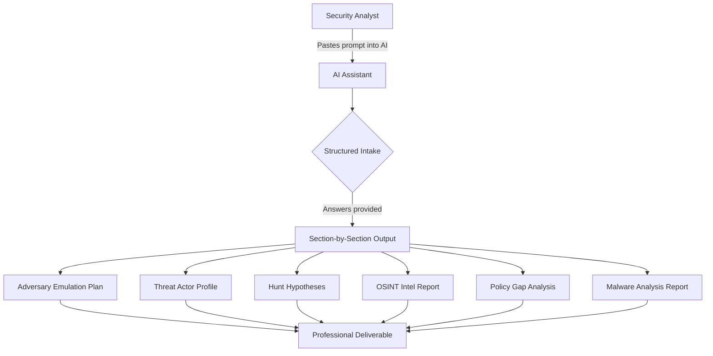

# Cybersecurity AI Prompts

Six production-grade AI prompts built for cybersecurity analysts, SOC teams,
and security professionals. Each prompt is engineered to guide an AI assistant
through a real analyst workflow — structured intake, section-by-section output,
and professional deliverables ready for tickets, reports, and briefings.

---

## Prompts Included

| Prompt | What It Does | Key Skills Demonstrated |
|---|---|---|
| [Adversary Emulation Planner](./adversary-emulation-planner/) | Builds a full purple team emulation plan from a threat actor name | MITRE ATT&CK, purple teaming, detection engineering |
| [Threat Actor Profiling Engine](./threat-actor-profiling-engine/) | Produces a structured CTI profile using the Diamond Model | CTI analysis, structured analytics, attribution |
| [Threat Hunt Hypothesis Generator](./threat-hunt-hypothesis-generator/) | Generates five query-ready hunt hypotheses for any environment | Threat hunting, KQL, SPL, proactive detection |
| [OSINT Recon Summarizer](./osint-recon-summarizer/) | Turns raw OSINT data into an attack surface intelligence report | OSINT, passive recon, attack surface analysis |
| [Security Policy Gap Analyzer](./security-policy-gap-analyzer/) | Maps a security policy against NIST, ISO, CIS, HIPAA, PCI-DSS | GRC, compliance, policy writing |
| [Malware Behavior Analyst](./malware-behavior-analyst/) | Produces a full malware analysis report from sandbox output | DFIR, YARA, IOC extraction, incident response |

---

## How It Works

---

## How to Use Any Prompt

1. Navigate to the prompt folder
2. Open `prompt.md`
3. Copy everything below the divider line
4. Paste into Claude, ChatGPT, or any AI assistant
5. Answer the intake questions when prompted
6. Review each output section before the AI moves to the next

---

## Prompt Engineering Approach

Each prompt was built using a structured methodology:

- **Role framing** — The AI is positioned as a specific domain expert
  before any output is generated
- **Structured intake** — All required context is collected upfront
  so the AI never makes assumptions about the environment
- **Modular output** — Complex deliverables are broken into labeled,
  reviewable sections rather than one large block of text
- **Safety gates** — Prompts for sensitive workflows include
  authorization checks and explicit approval requirements
- **Audience awareness** — Technical and executive output modes
  are built into prompts where the audience may vary
- **Professional formatting** — All output is structured for direct
  use in tickets, reports, and briefings without rewriting

---

## Requirements

- Any modern AI assistant (Claude, ChatGPT, Gemini)
- No API keys, installations, or configuration required
- Copy, paste, and answer questions — that is all

---

## Contributing

See [CONTRIBUTING.md](./CONTRIBUTING.md) to add a new prompt or
improve an existing one.

---

## License

MIT License — free to use, adapt, and share with attribution.
